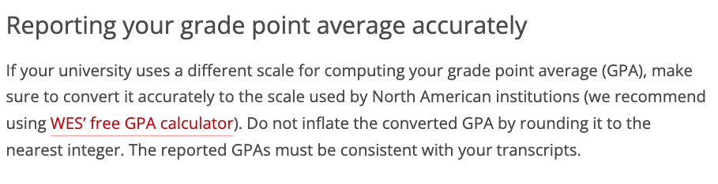
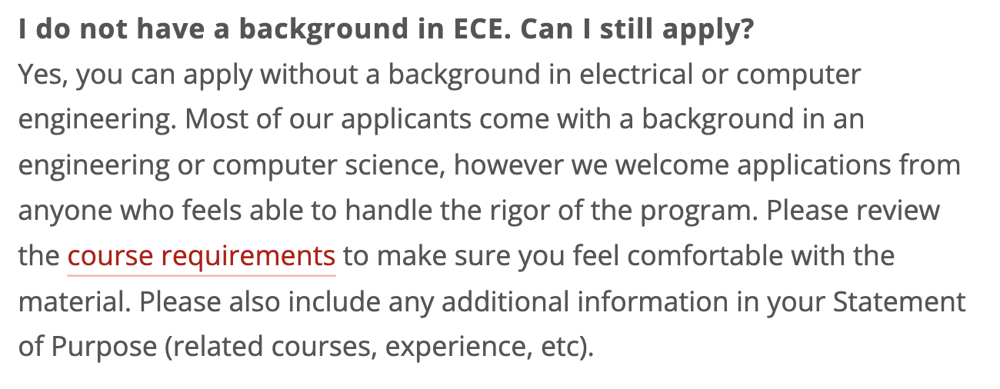

# MS-SE: Master of Science in Software Engineering

## Program Overview

|Basic Info.||
| :---: | :---: |
| **Department:** | Department of Electrical and Computer Engineering (ECE) |
| **Type:** | Full-time, Course-based |
| **Degree** | Master of Science (SM) |
| **Length** | 3 - 4 semesters |
| **STEM** | YES |
| **Rolling Admission** | NO |
| **Min TOEFL** | 84 (不接受拼分) |
| **Min IELTS** | 7.0 (有小分要求) |
| **GPA Cutoff** | NO |

---

## Master Admission

**网申通道：[点此链接](https://gradadmissions.engineering.cmu.edu/apply/)**

**申请截止日期 (early review)：DECEMBER 15, 11:59pm ET**

**申请截止日期 (submission deadline)：January 15, 11:59pm ET**

**通知日期: March- mid April (must also respond by April 15)**

**申请问题咨询邮箱**: apps@ece.cmu.edu

### Checklist
#### Required

- **Statement of Purpose (SOP)**

- **CV / Resumé**

- **Avergae GPA (`WES` Recommended)**

- **Academic Transcripts**
- **Three letters of recommendation**

- **TOEFL (明确接受家考)**

 

#### Optional
- **GRE Score**

 

### 已有硕士学位，能否申请? 

### ECE能否申请多个项目? 

### 不同背景的申请者须知

###  Admission Links

**[申请GuideLines](https://www.ece.cmu.edu/admissions/graduate-application-guidelines.html)**

**[申请要求表格](https://www.ece.cmu.edu/admissions/graduate-requirements.html)**

**[申请DDL](https://www.ece.cmu.edu/admissions/graduate-application-deadlines.html)**

**[GRE/TOEFL说明](https://www.ece.cmu.edu/admissions/index.html)**

**[FAQ -- Important](https://www.ece.cmu.edu/admissions/graduate-faq.html)**

