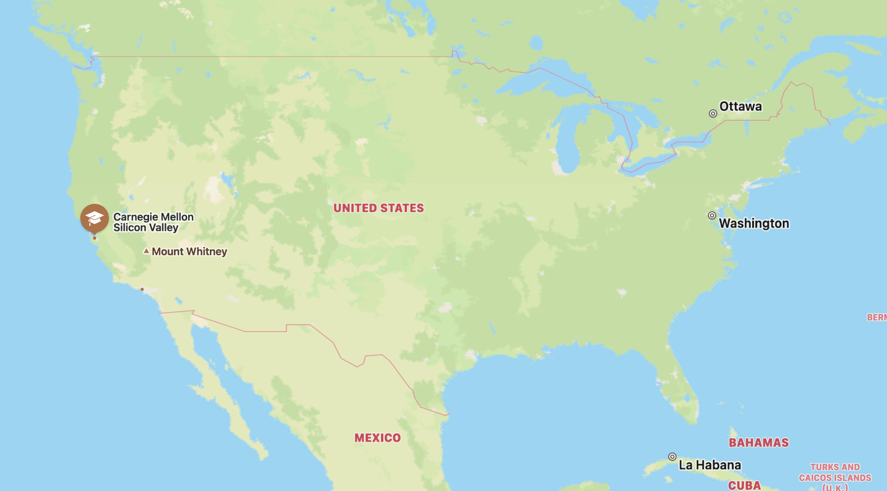
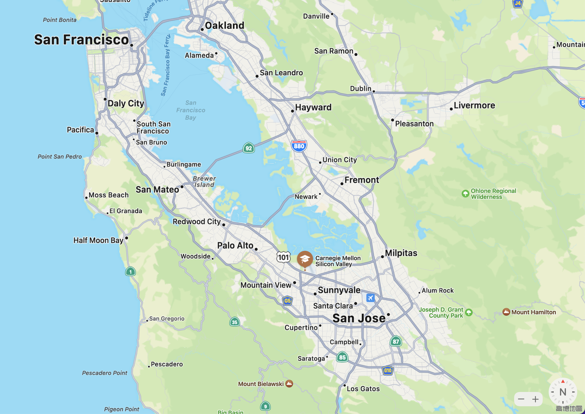

# Carnegie Mellon University, Silicon Valley
## Basic Information:
- Location: NASA Research Park, Bldg 23, Mountain View, CA 94035, United States
- National Ranking: #3
- CS Ranking: #2 (# 2-4)

 | 
--- | ---

> ### About CMU-SV
> For aspiring industry leaders, the San Francisco Bay Area is the perfect place to further technology and management skills and build valuable relationships. CMU-SV is a part of the dynamic atmosphere of Silicon Valley, fueling creativity and entrepreneurship. Students are prepared to meet technological and managerial challenges, to succeed in the 21st-century workforce, and to take a proactive part in shaping the future of the software and technology industry.
---
## Related Departments
### Department of Electrical and Computer Engineering (ECE)

The Department of Electrical and Computer Engineering (ECE) offers two degree programs at Carnegie Mellon University’s Silicon Valley campus.

- **MS-SE:** Master of Science in Software Engineering — exclusively at CMU-SV
- **MS-ECS:** Master of Science in Electrical & Computer Engineering

CMU’s graduate engineering programs are ranked in the top 10 nationally for computer, electronics, and communication engineering, and the department is renowned for its work to define, make an impact on, and lead in the field of electrical and computer engineering through its education and research agendas. 

---
## Personal Impression
