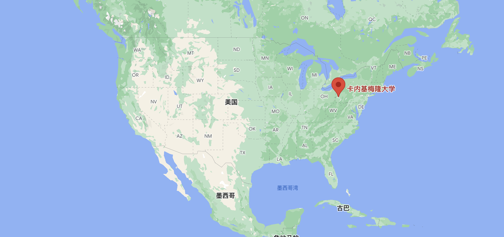
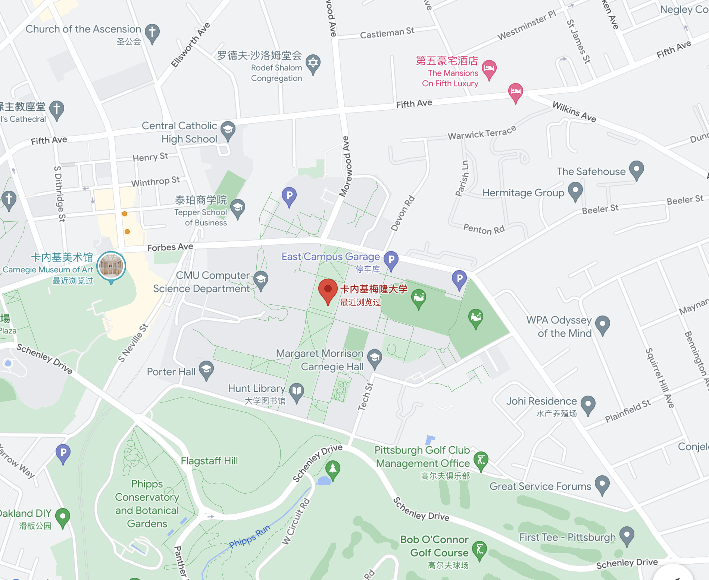

# Carnegie Mellon University

## Basic Information:
- Location: 5000 Forbes Ave, Pittsburgh, PA 15213, United States
- National Ranking: #22
- CS Ranking: #2 (2 - 4)

 | 
--- | ---

## Related Departments
### 1. School of Computer Science (SCS)

Carnegie Mellon’s School of Computer Science is widely recognized as one of the first and best computer science programs in the world. Our programs train the next generation of innovators to solve real-world problems and improve the way people live and work.

*For detailed information please go to this [link](https://www.cs.cmu.edu/).*

### 2. College of Engineering (CE)

The College of Engineering at Carnegie Mellon is a world-class engineering college recognized for excellence, innovation, and the societal relevance and impact of its pursuits. We produce creative and technically strong engineers and research pioneering solutions to global challenges. We do this with an unprecedented commitment to integrating across engineering, sciences, arts, business, and other disciplines to yield transformative results.

*For detailed information please go to this [link](https://engineering.cmu.edu/index.html).*

## Personal  Impression
**CMU, as far as I know, is where one of the best School of Computer Science locates.** Focusing on CS and Eng. part, the school’s program has a high standard in both admission and graduate 	requirement. As for master program, the traditional CS programs like MSCS are the hottest but also the most challenging ones.

**Anyone applying should be the best in CS undergraduate program, or show their extraordinary expertise and talent in CS if they are a CS undergraduate.**

Hard to apply for as it is, CMU provides **a variety of graduate programs for diverse applicants**. Each one of them has different level of difficulty to get in. You may encounter obstacle in extinguish multiple programs. **Here I provided links about links of program guides in [SCS](https://www.cmu.edu/graduate/academics/guide-to-graduate-degrees-and-programs/school-of-computer-science.html) and [CE](https://www.cmu.edu/graduate/academics/guide-to-graduate-degrees-and-programs/college-of-engineering.html#Information%20Networking%20Institute).**