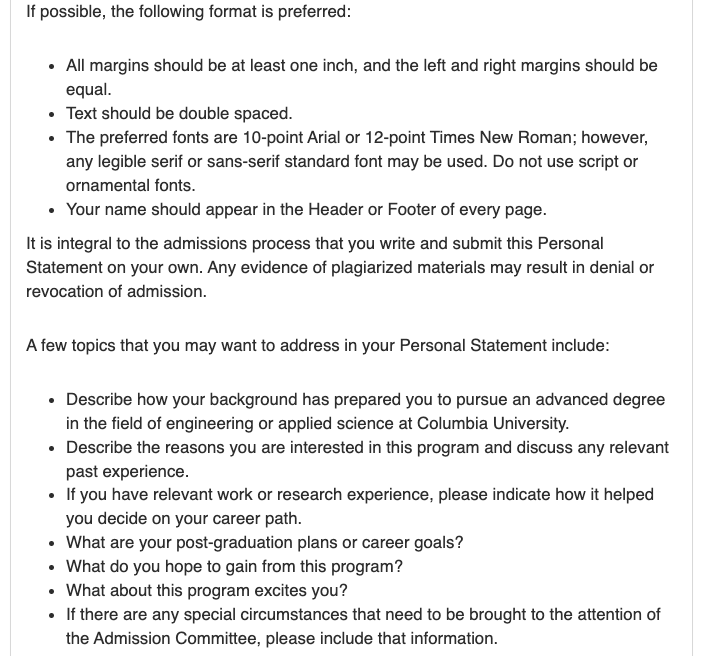

# MSCS: Master of Science in Computer Science

## Program Overview

|Basic Info.||
| :---: | :---: |
| **Department:** | Department of Computer Science, School of Engineering and Applied Sciences (SEAS) |
| **Type:** | Full-time, Coursework-only, Project, and Thesis options |
| **Degree** | Master of Science (SM) |
| **Length** | 1.5 years |
| **STEM** | YES |
| **Rollong Admission** | <U>YES</u> |
| **Ave TOEFL** | 101 Recommended |
| **Min IELTS** | 7.0 |
| **Ave GPA** | >3,5 |

### Tracks
- Computational Biology
- Computer Security
- Foundations of Computer Science
- Machine Learning
- Network Systems
- Natural Language Processing
- Software Systems
- Vision and Graphics
- Personalized
- MS Thesis

### 

---

## Master Admission

**网申网站: [点此链接](https://www.gradengineering.columbia.edu/graduate-admissions/apply)**

**申请截止日期:**
- 2023 FALL
  - 1st Priority: January 15
  - 2nd priority: February 15
- 2023 Spring
  - Noverber 15

**通知日期: **

**SEAS 申请 咨询邮箱: seasgradmit@columbia.edu**

**CS 申请 咨询邮箱: ms-admissions@lists.cs.columbia.edu**

**GT成绩报告咨询邮箱: seasgradmit@columbia.edu**

### Checklist
For detailed illustration click [here](https://www.gradengineering.columbia.edu/graduate-admissions/application-requirements).
#### Required

- **Official transcript**
- **Three recommendation letters**
- **Personal statement**

- **Resumé or Curriculum Vitae**
- **An interview may be requested**
- **TOEFL/IELTS**
 

#### Optional
- **GRE Score**  <u>optional 2023 only</u>

 

### 能否申请多个项目? 

### 已有硕士学位，能否申请? 

###  Admission Links

**[MSCS申请 Overview](https://www.cs.columbia.edu/education/admissions8/#deadlines)**

**[MSCS申请要求](https://www.gradengineering.columbia.edu/graduate-admissions/application-requirements)**

**[MSCS 申请 FAQ (重要)](https://www.cs.columbia.edu/education/ms/appfaq/)**

**[School of Eng. FAQ](https://www.gradengineering.columbia.edu/welcome/frequently-asked-questions-2)**