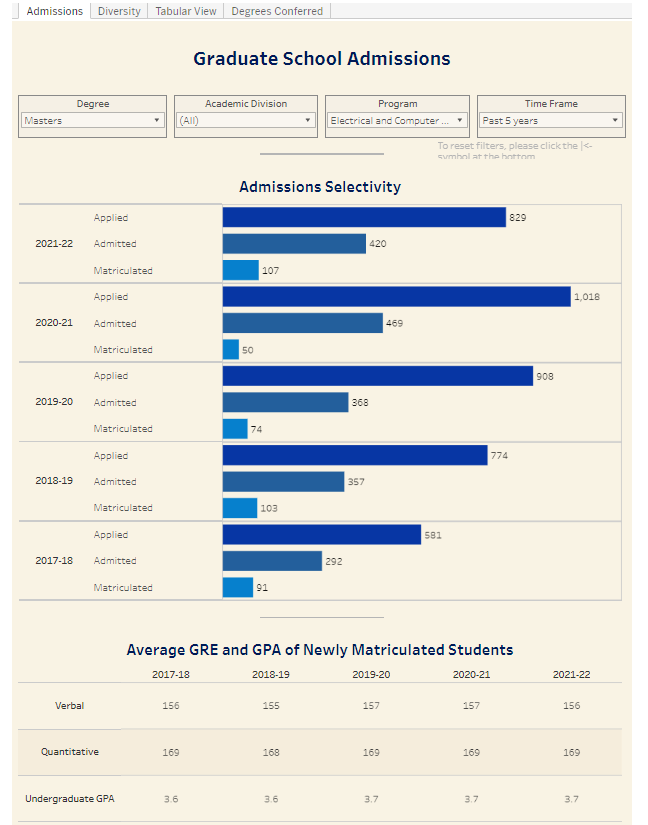
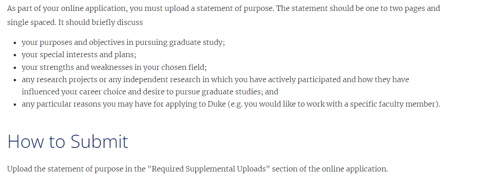
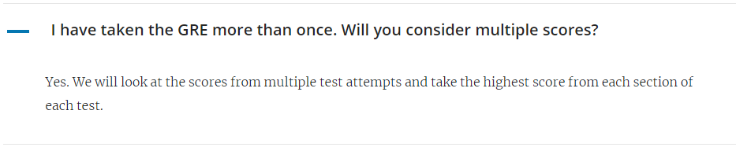
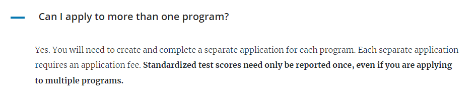

# ECE M.S.: Master of Science

## Program Overview

|Basic Info.||
| :---: | :---: |
| **Department:** | Department of Electrical and Computer Engineering (ECE) |
| **Type:** | Full-time, Coursework-only, Project, and Thesis options |
| **Degree** | Master of Science (SM) |
| **Length** | 3 semesters |
| **STEM** | YES |
| **Min TOEFL** | 90 |
| **Min IELTS** | 7.0 |
| **Ave GRE** | V.157 Q.169 W.4 |
| **Ave GPA** | 3.7 / 4.0 |
| **Min GPA** | 3.2 / 4.0 |

### Concentrations
Detail information go check [here](https://ece.duke.edu/masters/degrees/ms).

- Software Development
- Hardware Design
- Data Analytics & Machine Learning
- Quantum Computing
- Microelectronics, Photonics and Nanotechnology

### Admission Statistics

---

## Master Admission

**UCSD研究生申请管理网：[点此链接](https://applygp.duke.edu/apply/?sr=78cd3932-4807-42f6-a982-840eb2b744cc)**

**申请截止日期:**
- Guaranteed review: Jan. 1, 2023
- Review based upon space availability: Jan. 2-Feb. 29, 2023

**通知日期: April 1, 2022 (or later)**

### Checklist
#### Required

- **Transcripts** -- [详情见此](https://gradschool.duke.edu/admissions/application-instructions/transcripts/)
- **Letters of Recommendation** -- [详情见此](https://gradschool.duke.edu/admissions/application-instructions/letters-recommendation/)
- **Statement of Purpose (SOP)** -- [详情见此](https://gradschool.duke.edu/admissions/application-instructions/statement-purpose/)

- **Resume / C.V.** -- [详情见此](https://gradschool.duke.edu/admissions/application-instructions/resume-cv/)
- **TOEFL** -- [详情见此](https://gradschool.duke.edu/admissions/application-instructions/english-language-proficiency-test-scores/)
- **GPA: WES / ECE Reconmmended** -- [计算方式](https://gradschool.duke.edu/admissions/application-instructions/gpa/)
 

#### Optional
- **GRE Score**  <u>optional 2023 only</u> -- [详情见此](https://gradschool.duke.edu/admissions/application-instructions/gre-scores/)

 

### 能否申请多个项目? 

### 已有硕士学位，能否申请? 

###  Admission Links
**[ECE申请基本信息](https://ece.duke.edu/masters/admissions)**

**[Duke申请FAQ](https://gradschool.duke.edu/admissions/admissions-faqs/)**

**[Duke大学申请须知](https://gradschool.duke.edu/admissions/application-instructions/)**