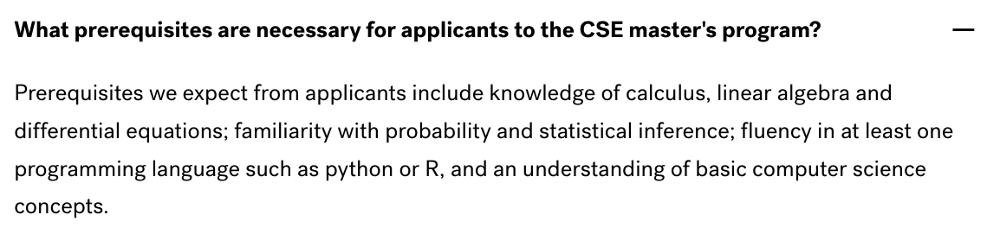

# CSE: MASTER'S IN COMPUTATIONAL SCIENCE AND ENGINEERING

## Program Overview

|Basic Info.||
| :---: | :---: |
| **Department:** |  Harvard John A. Paulson School of Engineering and Applied Sciences (SEAS) |
| **Type:** | Full-time, Course-based |
| **Degree** | **Master of Science (SM)** or **Master of Engineering (ME)**  |
| **Length** | Two Semesters **(can extend to Three)** |
| **STEM** | YES |
| **Rolling Admission** | NO |
| **Min TOEFL** | 80 |
| **Min IELTS** | 6.5 |

### Prerequisites Decription

---

## Master Admission

**网申通道：[点此链接](https://gsas.harvard.edu/admissions/apply)**

**申请截止日期：December 1, 2022**

**申请问题咨询邮箱**: admissions@seas.harvard.edu

### Checklist
#### Required
- **Online application form**
- **Statement of Purpose**
- **Three letters of recommendation submitted electronically**
- **Transcripts**
  > please upload copies of all transcripts to the Academic Background section of the online application; unofficial copies are acceptable.
- **C.V. or Resume**
- **TOEFL**
- **Supplemental Data form**
- **不接受GRE提交**

 
###  Admission Links

**[申请要求](https://www.seas.harvard.edu/applied-computation/graduate-programs/masters-computational-science-and-engineering/how-apply)**

**[FAQ](https://www.seas.harvard.edu/applied-computation/graduate-programs/masters-computational-science-and-engineering/faq)**