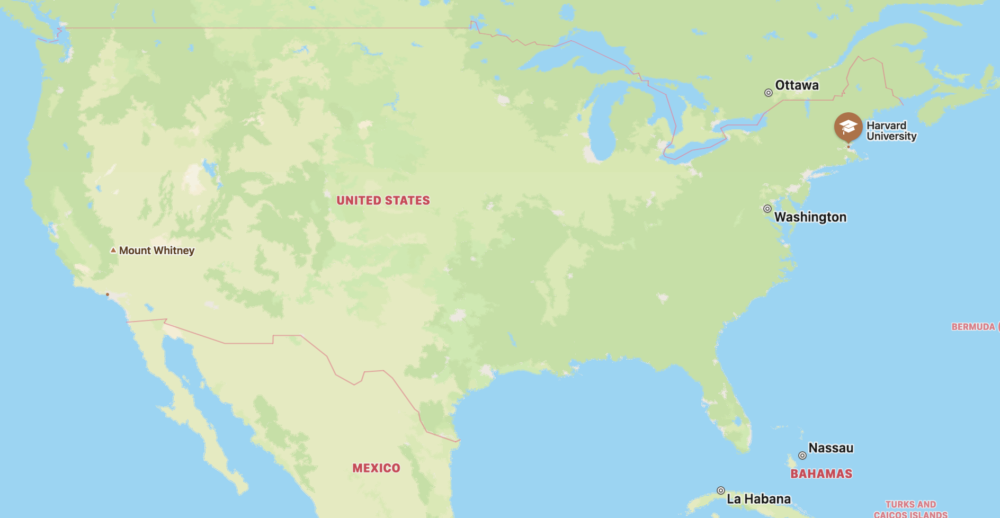
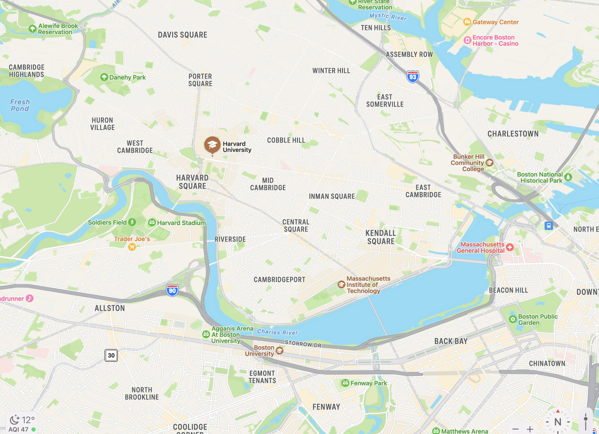

# Harvard University
## Basic Information:
- Location: Cambridge St. Cambridge, MA 02138, United States
- National ranking: # 3
- CS ranking: # 16

 | 
--- | ---

## Related Departments
### Harvard John A. Paulson School of Engineering and Applied Sciences (SEAS)

At the Harvard John A. Paulson School of Engineering and Applied Sciences (SEAS), we work within and beyond the disciplines of engineering and foundational science to address the most pressing issues of our time. SEAS has no departments; departments imply boundaries, even walls. Our approach to teaching and research is, by design, highly interdisciplinary. We collaborate across academic areas at SEAS and the larger university, and with colleagues in academia, industry, government and public service organizations beyond Harvard. This commitment to collaboration, and our community’s manageable scale, enable our undergraduate and graduate students, faculty, and researchers to advance knowledge, make groundbreaking discoveries, and develop technologies, products, and ideas that have the potential to improve lives the world over.

*For detailed information please go to this [link](https://www.seas.harvard.edu/)*

## Personal Description
Harvard is the best school