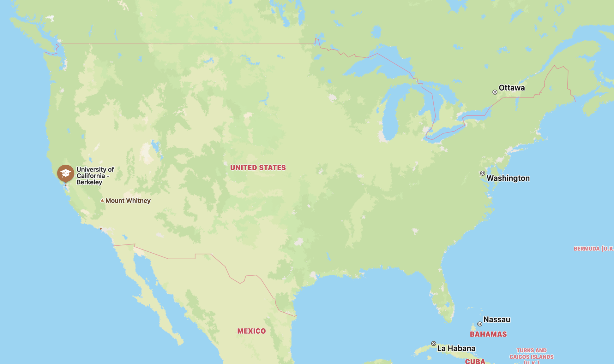
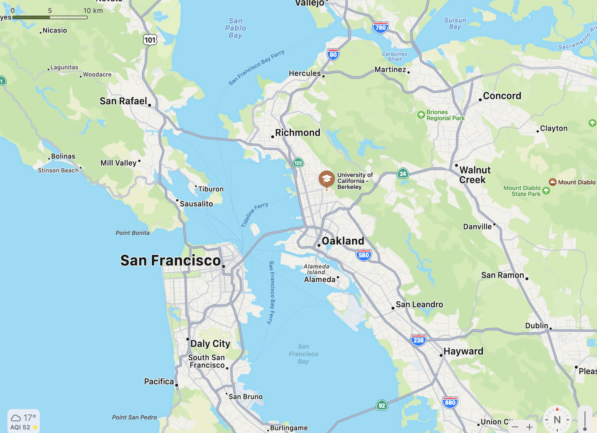

# University of California, Berkeley
## Basic Information:
- Location: Sather Rd Berkeley, CA  94709, United States
- National Ranking: #20
- CS ranking: #2 (# 2-4)

 | 
--- | ---

## Related Departments
### Electrical Engineering and Computer Science (EECS)

Berkeley EECS offers one of the most comprehensive instructional and research programs available anywhere in our field. We have a particular strength in large interdisciplinary real-world system projects that bring to bear core technologies seamlessly across electrical engineering and computer science.

*For detailed information please go to this [link](https://eecs.berkeley.edu/#)*

## Personal Description
UC Berkeley is definitely one of the top school in EECS area. The school is known for its strong science and engineering atmosphere. This quality can be seen from their admission requirements of EECS (Meng. here). Welcome to “career changers” as it would be, Berkeley is looking forward to manifestation of your competence in their so-called “challenging program” from your background experience. This you need to make your background convincing you are capable of handling their program. 
