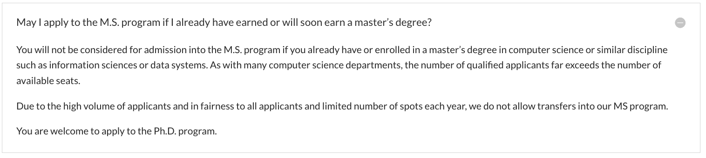

# MASTER of Science IN COMPUTATIONAL SCIENCE

## Program Overview

|Basic Info.||
| :---: | :---: |
| **Department:** |  UCLA Samueli School Of Engineering, Computer Science Department |
| **Type:** | Full-time, Course-based |
| **Degree** | Master of Science (SM)|
| **Length** | Two Years |
| **STEM** | YES |
| **Rolling Admission** |  Not Sure |
| **Admission Rate** | 150 / 4000 (3.75%) |
| **Min TOEFL** | 87 |
| **Min IELTS** | 7.0 |
| **Competitive GPA** | >3.5 |
| **Ave GPA** | 3.6 |

---

## Master Admission

**网申通道：[点此链接](https://grad.ucla.edu/admissions/)**

**申请截止日期：DECEMBER 15, 23:59, PST**

**通知日期: March- mid April (must also respond by April 15)**

### Checklist
#### Required

- **Three letters of recommendation**
- **Academic transcript**

- **TOEFL**
- **Statement of Purpose (SOP)** (500 word limit)
- **Personal history** (500 word limit)

#### Optional
- **GRE Score**
- **Resume or Vitae**

 

### 已有硕士学位，能否申请?

###  Admission Links

**[申请要求](https://www.cs.ucla.edu/graduate-requirements/)**

**[FAQ](https://www.cs.ucla.edu/graduate-admission-frequently-asked-questions/)**
