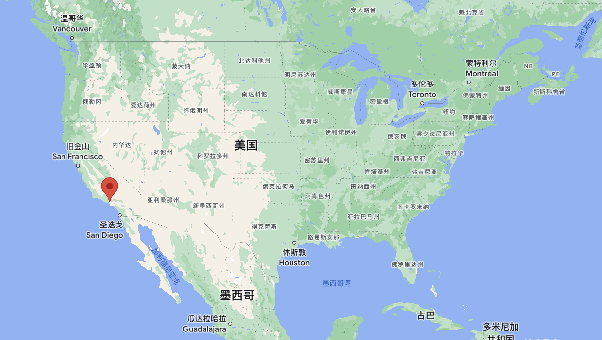
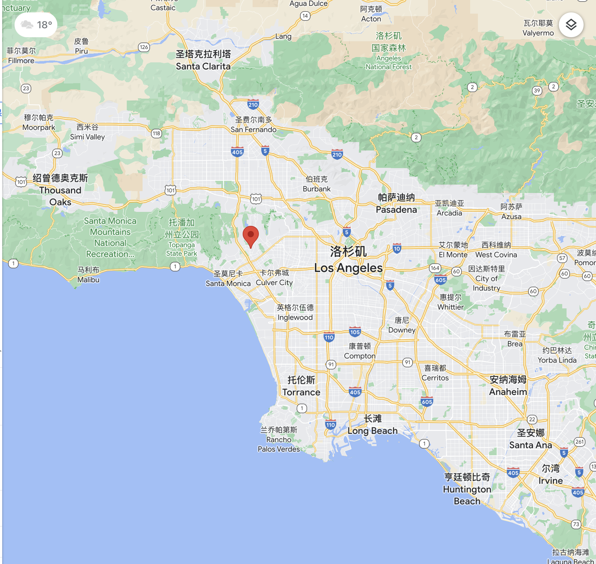
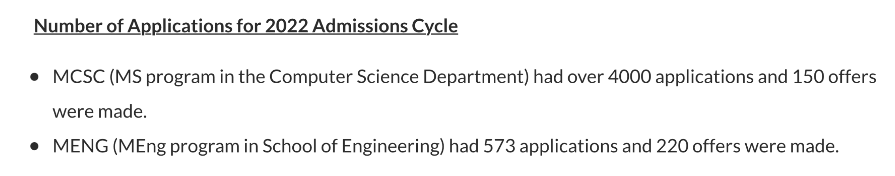

# University of California, Los Angeles

## Basic Information:
- Location: Los Angeles, CA 90095, United States
- National Ranking	: #20
- CS Ranking: #11 

 | 
--- | ---

## Related Departments

### Samueli Computer Science Department

The Computer Science Department strives for excellence in creating, applying, and imparting knowledge in computer science and engineering through comprehensive educational programs, research in collaboration with industry and government, dissemination through scholarly publications, and service to professional societies, the community, the state, and the nation.

*For detailed information please go to this [link](https://www.cs.ucla.edu/#).*

## Personal Impression
**UCLA is one of the tops among Universities of California and is also known for its professional CS level.** Even though UCB is better, but it doesn’t mean UCLA’s requirements for CS applicants is low. Viral competition can be seen from 2022 Fall application cycle shown below.

UCLA and its CS Dept. is definitely a valuable title in US. 