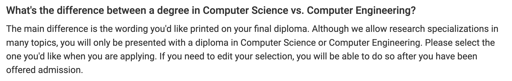

# ECE M.S.: Master of Science in Computer Science / Engineering

## Program Overview

|Basic Info.||
| :---: | :---: |
| **Department:** | Department of Electrical and Computer Engineering (ECE) |
| **Type:** | Full-time / Part-time, Course-based |
| **Degree** | Master of Science (SM) |
| **STEM** | YES |
| **Admission Rate** |  |
| **Min TOEFL** | 85 |
| **Min IELTS** | 7.0 |
| **GPA Cutoff** | 3.0 / 4.0 |

### Research Areas
Variety of research branches of M.S. programs for diverse background of applicants are provided, **including but not limited to**:

- Applied Physics- Electronic Devices & Materials
- Communication Theory & Systems
- Computer Engineering (Impacted)
- Machine Learning & Data Science (Impacted)
- Photonics
- Signal & Image Processing

---

## Master Admission

**网申通道：[点此链接](https://connect.grad.ucsd.edu/apply/)**

**网申通道：[点此链接](https://grad.ucsd.edu/admissions/index.html)**

**申请截止日期：Wednesday, December 7th
by 11:59pm (California time)**

**通知日期: April 14, 2023**

**申请问题咨询邮箱: ecegradapps@eng.ucsd.edu**

### Checklist
#### Required

- **Scanned unofficial copies of transcripts** -- [详情见此处](https://grad.ucsd.edu/admissions/requirements/academic-transcripts.html)
- **Statement of Purpose (SOP)** -- 
- **Three Letters of Recommendation**
- **GRE: REQUIRED**
- **TOEFL (明确接受家考)**
- **Resume/CV**

 

### 已有硕士学位，能否申请? 

### MS in CS 和 MS in CE的区别

### 不同背景的申请者须知

###  Admission Links
**[申请基本信息](https://cse.ucsd.edu/graduate/admissions)**

**[申请提交CheckList](https://cse.ucsd.edu/graduate/cse-graduate-application-checklist)**

**[CSE MS院系FAQ](https://cse.ucsd.edu/graduate/graduate-admissions-faq)**

**[USCD申请总FAQ](https://grad.ucsd.edu/admissions/admission-faq/index.html)**

**[给申请者的建议](https://cse.ucsd.edu/graduate/advice-cse-graduate-studies-preparation)**