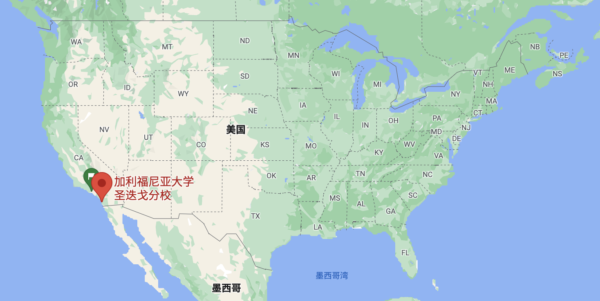
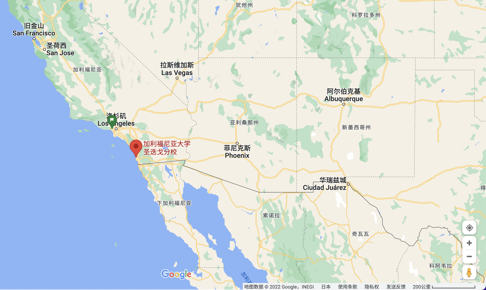

# # University of California, San Diego
## Basic Information:
- Location: 450 Serra Mall, Stanford, CA 94305, United States
- National Ranking: #3
- CS Ranking: #2 (# 2-4)

## Related Departments
### 1. Department of Computer & Engineering (CSE Dept.)

As with our PhD programs, CSE Dept. offer majors in both **computer science** and **computer engineering**.

Both majors are available in each of our three MS plans: [<u>Thesis Plan</u>](https://cse.ucsd.edu/graduate/degree-programs/ms-program/ms-2015-thesis), [<u>Comprehensive Standard Plan</u>](https://cse.ucsd.edu/graduate/degree-programs/ms-program/ms-2015-comp-standard), or [<u>Comprehensive Interdisciplinary Plan</u>](https://cse.ucsd.edu/graduate/degree-programs/ms-program/ms-2015-comp-interdisc). 

Course requirements are intended to ensure that students are exposed to
1. Fundamental concepts and tools
2. Advanced, up-to-date views in topics outside their area **(the Breadth requirement)**
3. A deep, current view of their research or specialization are **(the Depth requirement)**.

The Interdisciplinary Option requires additional coursework in another department.  Courses may not fulfill more than one requirement.

*Go to CSE [Master Program general](https://cse.ucsd.edu/graduate/degree-programs/ms-program) for more detialed illustration.*

### 2. Department of Electrical & Computer Engineering (ECE Dept.)

