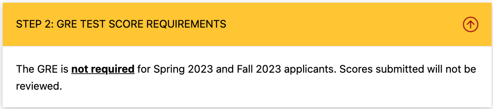
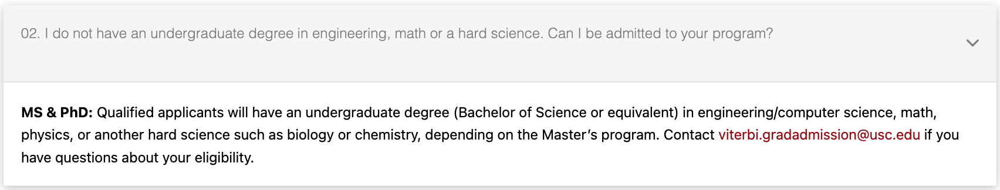
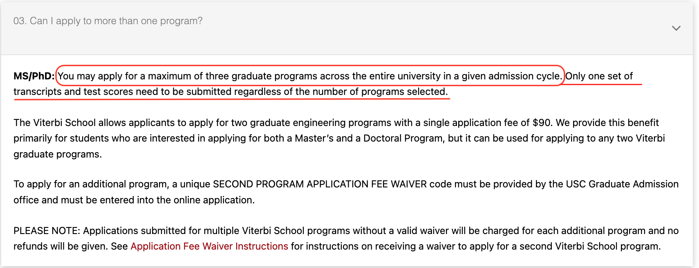
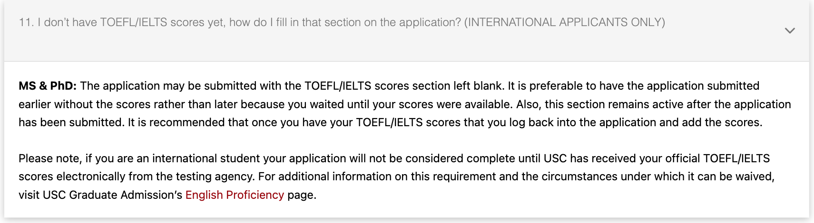

# MS Tracks

## Programs Overview
|Basic Info.||
| :---: | :---: |
| **Department:** | Department of Computer Science |
| **Type:** | Full-time |
| **Degree** | Master of Science (SM) |
| **STEM** | YES |
| **Min TOEFL** | 90 (不接受拼分 / MyBest scores) (每项至少20) |
| **Min IELTS** | 6.5 |

### Trank I: Master of Science in Computer Science

[项目主页](https://www.cs.usc.edu/academic-programs/masters/computer-science-general/)

### Trank II: Master of Science in Computer Science (Software Engineering)

[项目主页](https://www.cs.usc.edu/academic-programs/masters/software-engineering/)

**NOTE: 该项目自2021年可能被取消，请及时关注[此处List of Master's Programs](https://viterbigradadmission.usc.edu/programs/masters/msprograms/computer-science/)**

### Trank III: Master of Science in Computer Science for Scientists and Engineers

**Length of Program: 2 years**
[项目主页](https://www.cs.usc.edu/academic-programs/masters/software-engineering/)

### 

---

## Master Admission

**网申网站: [点此链接](https://viterbigradadmission.usc.edu/programs/masters/apply/ready-to-apply/)**

**申请截止日期: December 15, 11:59 PM (23:59), Eastern Time**

**MS 申请 咨询邮箱: viterbi.gradadmission@usc.edu**

### Checklist
For detailed illustration click [here]().

#### Required

- **Transcripts (electronic or scanned)**
- **TOEFL: 接受家考，不接受MyBest score**
- **CV/Résumé**
- **Personal Statement**
- **Letters of Recommendation**
 

#### Optional
- **GRE Score: 不接受**

 

### 其他背景的申请者? 

### 能否申请多个项目? 

### 提交申请后可以上交托福成绩吗?

### 已有硕士学位，能否申请? 

###  Admission Links
#### USC校级网站
**[USC Catalog -- 最权威信息](https://catalogue.usc.edu/)**

**[USC English Proficiency Requirements](https://gradadm.usc.edu/lightboxes/international-students-english-proficiency/)**

#### School of Vertibi 相关网站
**[School of Vertibi -- MS Programs Admission Overview](https://viterbigradadmission.usc.edu/programs/masters/msprograms/)**

**[School of Vertibi -- Admission FAQ](https://viterbigradadmission.usc.edu/programs/masters/faq/)**

**[School of Vertibi -- APPLICATION INFORMATION AND DEADLINES](https://viterbigradadmission.usc.edu/programs/masters/apply/)**